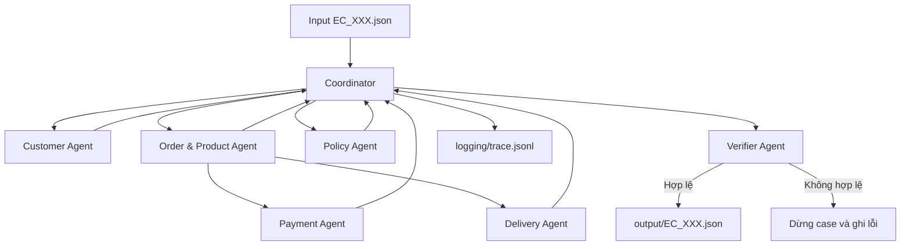

# Kiến trúc giải pháp cá nhân — Multi-Agent E-commerce Dispute Resolution

> Implementation deterministic đã được chạy và kiểm chứng trên nhánh
> `solution/02020-DuongTienDung`.

## 1. Mục tiêu

Hệ thống xử lý 50 case trong `input/`, đối chiếu dữ liệu Olist và tạo JSON tương
ứng trong `output/`. Phép tính tiền, thời gian, policy và kiểm tra ID được thực
hiện bằng mã deterministic; các agent trao đổi bằng contract có cấu trúc.

## 2. Sơ đồ agent

## 3. Vai trò và quyền truy cập

| Thành phần | Dữ liệu được đọc | Output bàn giao |
|---|---|---|
| Coordinator | Input và handoff của agent | Draft output hoàn chỉnh |
| Customer Agent | Orders, customers | Customer identity và order history |
| Order & Product Agent | Orders, items, products, sellers | Order, item, seller, product context |
| Payment Agent | Payments và tổng item/freight | Payment reconciliation |
| Delivery Agent | Order timestamps và shipping limits | Delivery/handoff variance |
| Policy Agent | Structured facts, `EC_POLICY_V2` | Issue, root cause, responsibility, refund, actions |
| Verifier Agent | Draft và read-only repository | Danh sách lỗi hoặc xác nhận hợp lệ |

## 4. Contract và handoff

- Mọi handoff dùng dataclass/dictionary có field xác định, không truyền toàn bộ CSV.
- Coordinator dùng `claimed_order_id` làm khóa điều tra duy nhất.
- Related orders chỉ nằm trong `customer_context.related_order_ids`.
- Agent không tự tạo ID hoặc sự kiện không tồn tại trong dữ liệu nguồn.
- Verifier tái tính các giá trị quan trọng thay vì tin hoàn toàn vào draft.

## 5. Luồng xử lý

1. Nạp và index CSV một lần khi khởi động.
2. Đọc input theo thứ tự `EC_001` đến `EC_050`.
3. Chạy các agent domain và thu structured facts.
4. Áp dụng policy theo đúng thứ tự ưu tiên trong README.
5. Dựng evidence từ whitelist.
6. Verifier kiểm tra schema, ID, số tiền, null, thứ tự và giới hạn mảng.
7. Chỉ ghi output khi verification thành công.
8. Ghi trace mới cho lần chạy hiện tại và metadata sau khi hoàn thành.

## 6. Tính tái lập và chống hallucination

- Dùng `Decimal` cho tiền và làm tròn hai chữ số.
- Timestamp được so sánh nguyên trạng, không đổi múi giờ.
- Mảng unique theo thứ tự nguồn; không dùng set làm mất thứ tự.
- Policy, evidence và giới hạn schema nằm trong code.
- Nếu tích hợp LLM, model của từng agent phải không vượt quá 10B và output vẫn qua verifier.

## 7. Quan sát và xử lý lỗi

`logging/trace.jsonl` được truncate ở đầu mỗi run và ghi một JSON trên mỗi dòng.
Trace không ghi secret hoặc chain-of-thought. Một case lỗi khiến CLI trả exit code
khác 0 và không ghi output chưa được xác minh.

## 8. Runtime và model

Các agent hiện là agent deterministic bằng Python, không gọi LLM. Vì vậy không có
agent nào vượt giới hạn model 10B và kết quả không phụ thuộc sampling. Metadata ghi
`deterministic-rule-engine`, parameter size `0B`, provider `local-code`. Nếu nhóm thay
bằng LLM ở bước tích hợp, tên model phải khai báo trong source, model không quá 10B
và toàn bộ output vẫn phải qua verifier hiện tại.

## 9. Kết quả kiểm chứng

- 50/50 input tìm thấy claimed order.
- 50/50 case được sinh output và verifier chấp nhận.
- 0 case thất bại trong lần chạy gần nhất.
- Phân bố issue: 8 canceled, 6 unavailable, 10 late seller, 10 late logistics,
  8 valid split payment và 8 unsupported late claim.
