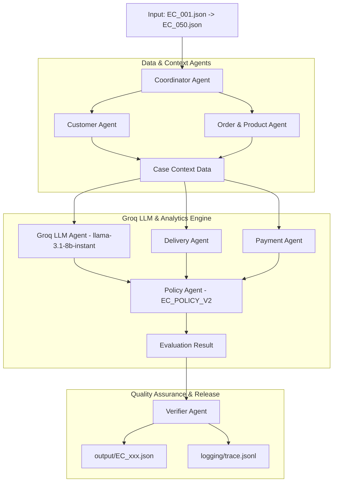

# Multi-Agent Architecture for E-commerce Dispute Resolution

## 1. Sơ đồ Kiến trúc Multi-Agent & Luồng Handoff

## 2. Vai trò & Quyền truy cập dữ liệu của từng Agent

| Tên Agent | Vai trò chính | Thao tác / Quyền truy cập Dữ liệu |
| :--- | :--- | :--- |
| **Coordinator Agent** | Nhận case, điều phối handoff giữa các agent và tổng hợp output | Read `input/*.json`, Orchestrate workflow |
| **Customer Agent** | Tra cứu danh tính và lịch sử đơn hàng của khách | Read `olist_customers_dataset.csv`, `olist_orders_dataset.csv` |
| **Order & Product Agent** | Trích xuất đơn hàng, items, sellers, sản phẩm và dịch tên danh mục | Read `olist_order_items_dataset.csv`, `olist_products_dataset.csv`, `product_category_name_translation.csv` |
| **Groq LLM Agent** | Gửi tin nhắn khiếu nại & dữ liệu case tới LLM thật (`llama-3.1-8b-instant`) | Call Groq API via `.env` API Key, output natural reasoning |
| **Delivery Agent** | Phân tích mốc thời gian giao hàng & độ lệch giờ của Seller/Carrier | Calculate `delivery_variance_hours`, `handoff_variance_hours` |
| **Payment Agent** | Tính tổng tiền hàng, phí vận chuyển và đối soát số tiền thực trả | Reconcile payment vs expected total (`abs(diff) <= 0.10 BRL`) |
| **Policy Agent** | Xếp loại Primary/Secondary Issues, khoản hoàn tiền và actions theo `EC_POLICY_V2` | Evaluate business policy rules, generate evidence IDs |
| **Verifier Agent** | Audit schema JSON, kiểm tra giới hạn độ dài mảng và làm tròn số | Format schema, truncate array limits, write `output/*.json` & `logging/trace.jsonl` |

## 3. Luồng Handoff & Kiểm chứng Dữ liệu

1. **Step 1 (Input & Handoff Context)**: `Coordinator Agent` chuyển `claimed_order_id` cho `Customer Agent` và `Order & Product Agent` để lấy dữ liệu thô.
2. **Step 2 (LLM & Analysis Handoff)**: Dữ liệu thô (`CaseContext`) được gửi tới `Groq LLM Agent` (`llama-3.1-8b-instant`) để phân tích lập luận từ tin nhắn khiếu nại của khách, đồng thời gửi tới `Delivery Agent` và `Payment Agent` để tính toán tài chính.
3. **Step 3 (Policy Decision)**: Kết quả suy luận LLM và số liệu tính toán chuyển cho `Policy Agent` để quyết định quy tắc hoàn tiền và các hành động xử lý.
4. **Step 4 (Verification & Export)**: `Verifier Agent` nhận kết quả cuối cùng, tiến hành làm sạch, ép kiểu, cắt tỉa mảng quá giới hạn (max limit) và ghi xuất file output chuẩn.
